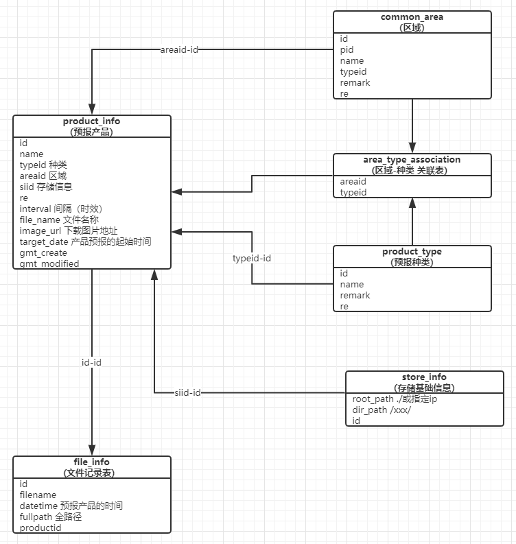

读取的预报产品数据存储在指定ftp目录下  

# 处理产品的相关逻辑如下图

1. 定期遍历指定目录  
   	 所有文件的所在根目录(root_path)是相同的均为（showimgdata）  
    1 从预报产品(product_info)表中遍历(一共应该有9种)所有的产品info  
    2 根据re判断符合条件的file list  
    3 根据存储信息（store_info）表中的信息找到该file list对应的存储路径 dir_list  
2. 将文件集合复制至新的路径下  
    1 targetpath/yyyy/mm/dd/  
    2 根据 fille_list 与 dir_list，以及当前的时间(yyyy/mm/dd)将file_list 遍历并复制到目标路径下  
3. 将文件记录写入数据库  
    1 将文件相关信息写入文件信息表(file_info)  

1. 加载条件  
	起止时间  
	产品种类(type)  
	区域（area）  
2. 从相关各表检索出预报产品(product_info)  
	1 根据area从common_area表中找到符合的对象  
	2 根据type从product_type表中找到符合的对象  
	3 从product_info中根据areaid与typeid找到符合条件的对象（唯一）  
3. 根据product_info从file_info表中找到文件相关信息  
	根据pid从file_info表中找到符合条件的对象  
4. 返回对应的产品所在路径(图片)  
	将product_info返回  

# 与产品相关的数据库设计如下:
