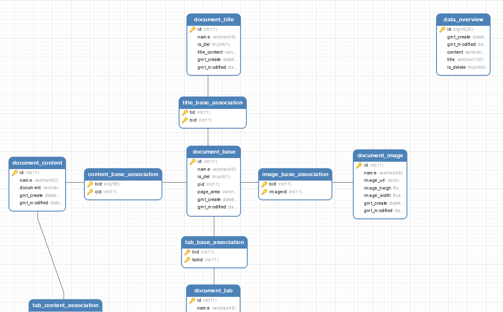
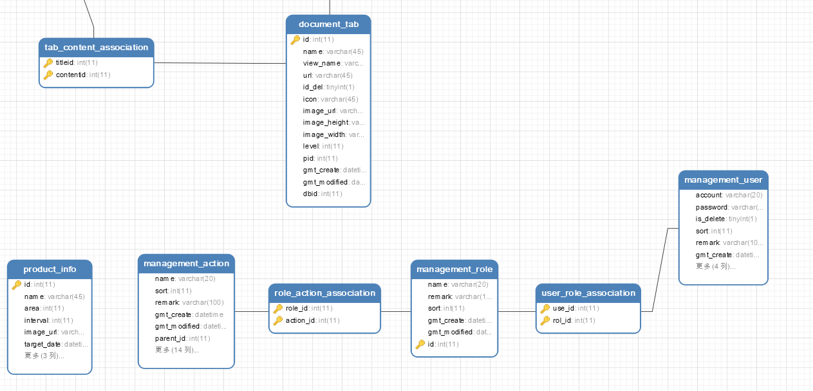
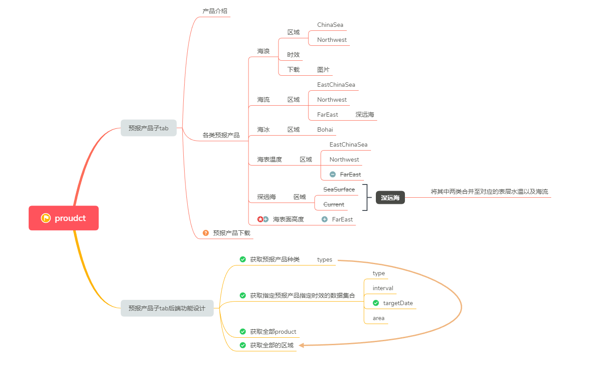
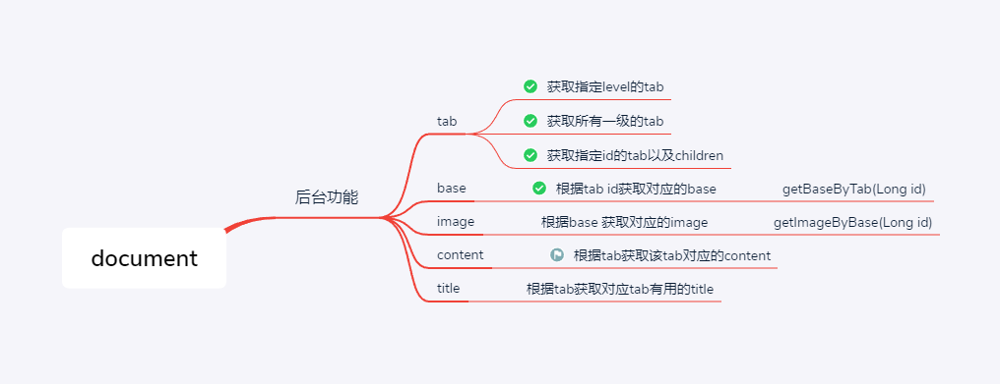
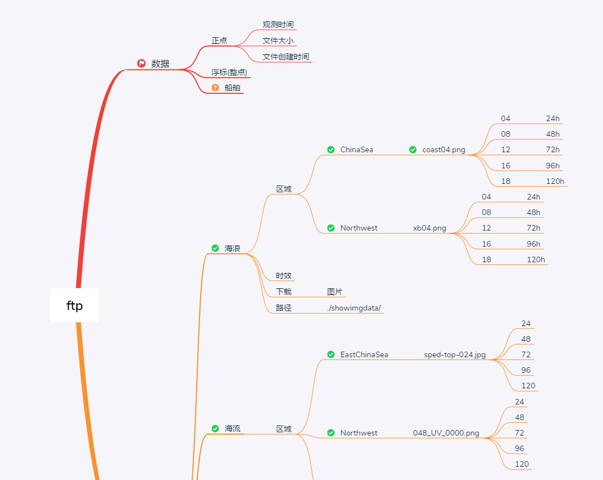
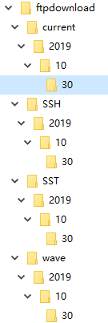
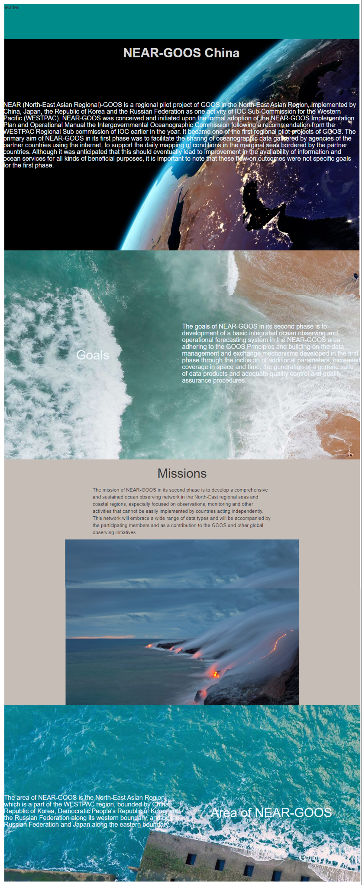
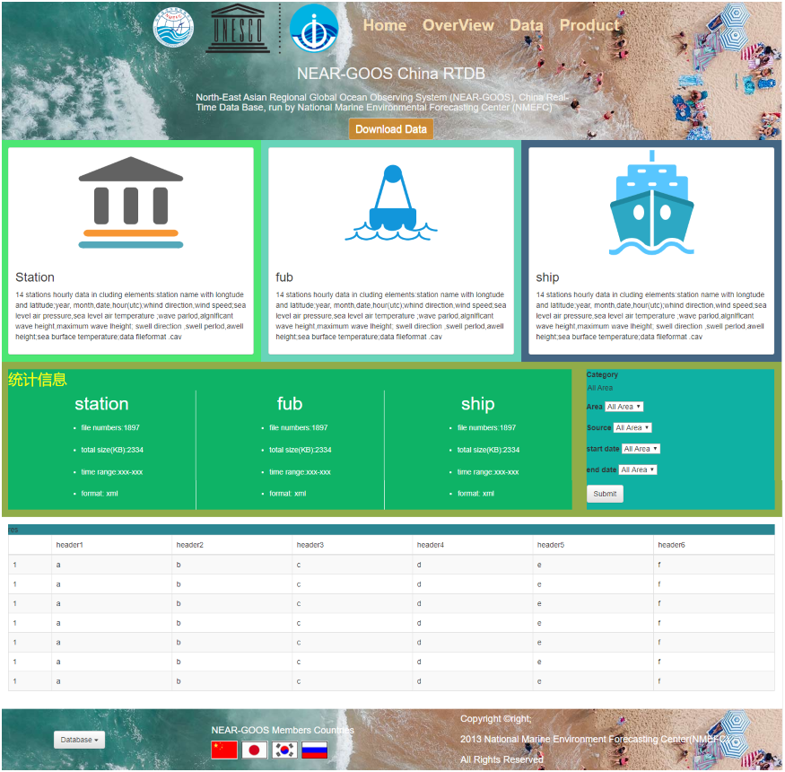

- 本文档为进度计划

- 19-10-19~20

- [x] 1. 完成了`product`的`service`以及`entity`映射
- [x] 2. 完成了`document`的`service`以及`entity`的部分映射
- [x] 3. 完成了`document`的`tab`与`base`的业务逻辑

  - [x] 获取指定 level 的 tab
  - [x] 获取所有一级的 tab
  - [x] 获取指定 id 的 tab 以及 children
  - [x] 根据 tab id 获取对应的 base

  数据库设计修改如下:
  
  
  业务逻辑如下:
  
  
  

---

- 19-10-21
- [x] 1. 完成了根据 base 获取对应的 image(`getImageByBase(Long id)`)
     19-10-29

- [x] 修改了处理流程  
       采取了定时根据种类字典（不用根据种类-区域）获取对应产品的文件匹配规则  
       获取 ftp 中符合条件的 file list  
       将制定的 file list 复制到本地指定目录下  
       - 未完待续
      
      
- [x] 数据名称规范如下
      
      

---

19-10-30

- [x] 考虑将 ftp 类中的`_copy_list`与`_get_match_list`抽稀出来
- [x] 实现`wave` `current` `ice` `sst` `ssh`几种产品种类的分类存储
  - 分类存储目录结构如下
    
- [ ] 暂未实现写入数据库的操作——此处流程可能再做修改？
- [ ] ftp 删除操作暂未实现（等测试通过后实现）

---

19-10-31

- [x] 加入定时任务 by [APScheduler](https://apscheduler.readthedocs.io/en/latest/userguide.html#)
- [x] 加入持久保存功能(使用 mongo)
      
- [x] 部分汇总在 onenote 中

---

19-11-09
前面有部分进度放在 todo 中了，以后只记录几个关键节点的进度

- [x] 1. 完成 home_1 的样例  
     

---

19-11-11

- [x] 1. 按照样例页面实现了 overview
     
- [x] 2. 相关介绍（可切换组件）
- [x] 3. footer
     

---

19-11-12

- [x] 1. 实现了 home 页
     

---

19-11-13

- [x] 1. 简单完成了 `product` 页

---

19-16-17
- [x] 1. 周末简单完成了`data`页的布局和初始样式（剩下的美化的周一再说了）
      
